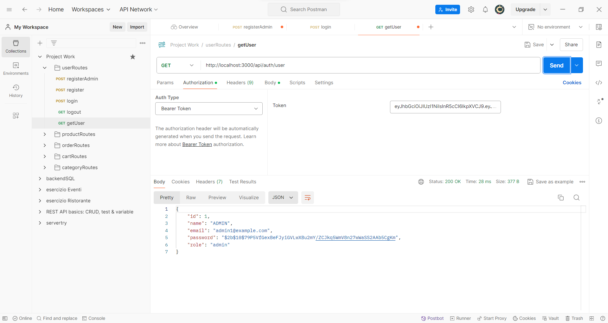
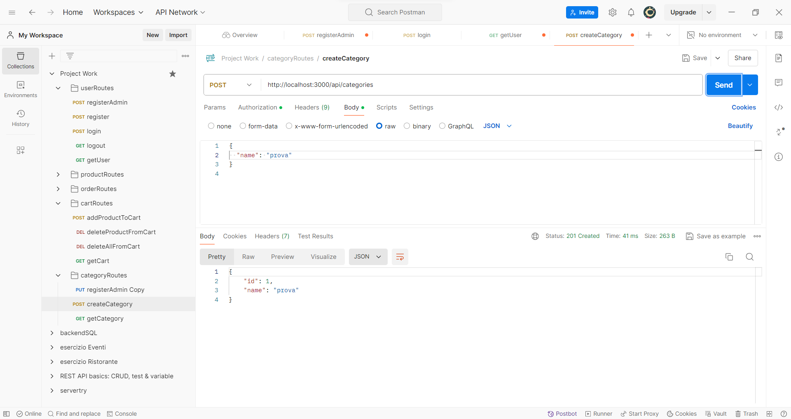
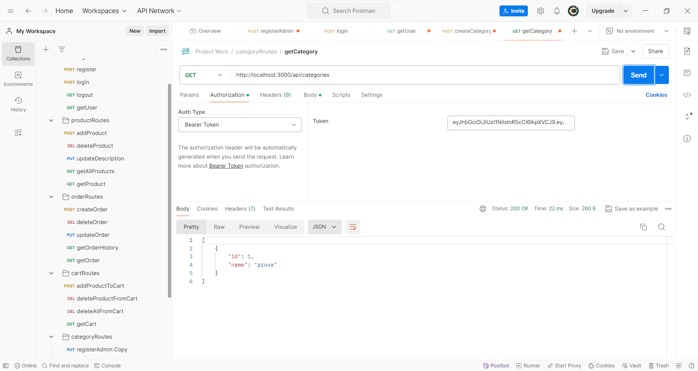
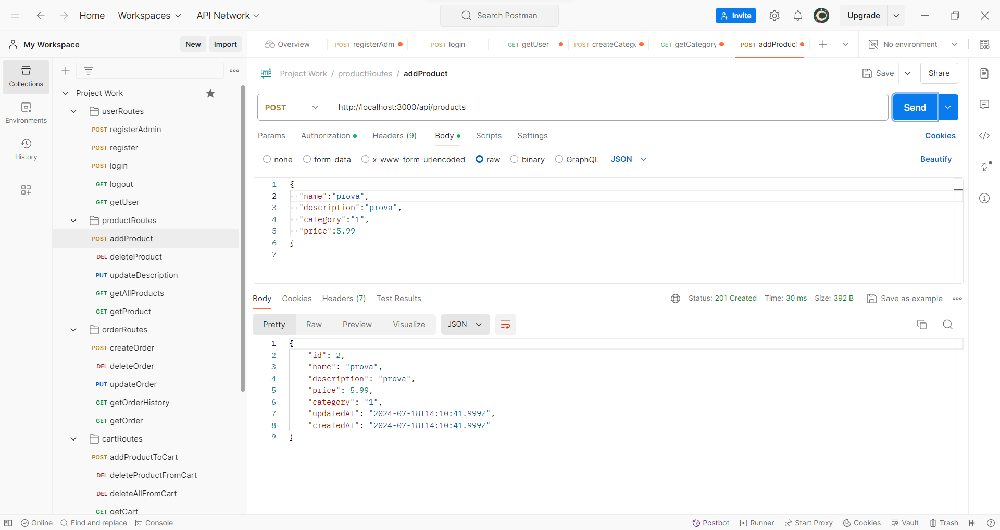
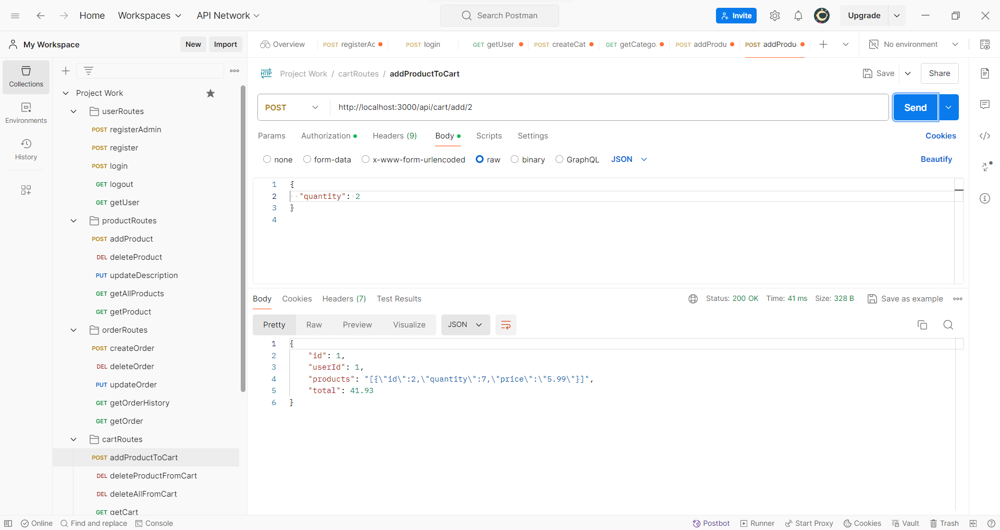
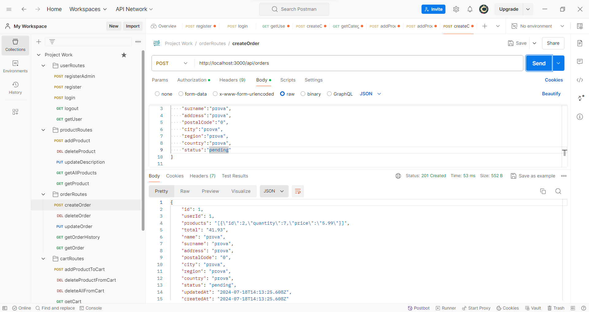

# ecommerce-CODE
## Project CODE | Project Work
### Descrizione generale
Il caso-studio proposto per questo Project Work riguarda la creazione di una piccola piattaforma e-commerce che permette agli utenti di visualizzare tutti i prodotti disponibili, effettuare ricerche e acquistare prodotti. L'obiettivo principale dell'esercizio è permettere agli studenti di applicare le loro conoscenze di programmazione backend e frontend per creare un sistema funzionante che consenta agli utenti di interagire con i prodotti.

#### Tipologie di utenze previste
#### User generico
Può visualizzare i prodotti disponibili.
Può acquistare i prodotti disponibili.
Può visualizzare lo storico dei prodotti che ha acquistato.
#### Utente Admin
Può aggiungere nuovi prodotti.
Può aggiungere nuove categorie.
Può modificare i prodotti disponibili.
Può rimuovere i prodotti disponibili.
Nota: per semplificare lo sviluppo, assumiamo che ogni utente Admin possa interagire con ogni prodotto disponibile, anche se il prodotto è stato caricato da un altro utente Admin della piattaforma.

### Obiettivi del Progetto
Fornire agli studenti un'esperienza pratica nello sviluppo di un'applicazione backend completa utilizzando Node.js.
Migliorare le competenze di progettazione e sviluppo software, inclusa la progettazione di API RESTful, l'integrazione di database e l'implementazione di funzionalità avanzate come l'autenticazione.
Aiutare gli studenti a comprendere i concetti fondamentali di sicurezza informatica e pratiche di sviluppo sicuro.
Preparare gli studenti per lavorare su progetti reali e sviluppare competenze trasferibili nel campo dello sviluppo web e della programmazione backend.
### Tecnologie Utilizzate
Node.js per lo sviluppo del backend. <br>
Express.js per la creazione di un'applicazione web robusta e scalabile.
MySQL per la memorizzazione dei dati dei prodotti, degli utenti e degli ordini.
JWT (JSON Web Tokens) per l'autenticazione e l'autorizzazione degli utenti.
API RESTful per consentire l'accesso alle funzionalità del backend da parte di client esterni, come un'applicazione web frontend o un'app mobile.
Git per il controllo della versione del codice.
### API realizzate
#### API di autenticazione
POST ```/api/auth/register```: Permette agli utenti generici di registrarsi fornendo le informazioni necessarie come nome, email e password.<br>
POST ```/api/auth/admin/register```: Permette agli utenti admin di registrarsi fornendo le informazioni necessarie come nome, email e password. Implementare un controllo dell’email a fronte di una whitelist di indirizzi email abilitabili all’accesso come Admin.<br>
POST ```/api/auth/login```: Consente agli utenti di effettuare l'accesso utilizzando le proprie credenziali.<br>
GET ```/api/auth/logout```: Permette agli utenti di disconnettersi.<br>
GET ```/api/auth/user```: Restituisce le informazioni dell'utente attualmente autenticato (generico o Admin).<br>


#### API per la gestione delle categorie (solo admin)
GET ```/api/categories```: Restituisce l’elenco completo delle categorie.<br>
POST ```/api/categories```: Crea una nuova categoria (verificare che non ne esiste già una con lo stesso nome).<br>
PUT ```/api/categories/:id```: Modifica una categoria già esistente.<br>



#### API per la gestione dei prodotti
GET ```/api/products```: Restituisce l'elenco completo dei prodotti disponibili nel catalogo.<br>
GET ```/api/products/:id```: Restituisce i dettagli di un singolo prodotto (identificato dal suo ID).<br>
POST ```/api/products```: Permette agli utenti Admin di aggiungere un nuovo prodotto al catalogo (gestire anche la categoria).<br>
PUT ```/api/products/:id```: Consente agli utenti Admin di modificare le informazioni di un prodotto esistente.<br>
DELETE ```/api/products/:id```: Permette agli utenti Admin di eliminare un prodotto dal catalogo.<br>

#### API per la gestione del carrello
GET ```/api/cart```: Restituisce il contenuto attuale del carrello dell'utente.<br>
POST ```/api/cart/add/:id```: Aggiunge un prodotto al carrello dell'utente.<br>
DELETE ```/api/cart/remove/:id```: Rimuove un prodotto dal carrello dell'utente.<br>
DELETE ```/api/cart/clear```: Svuota il carrello dell'utente.<br>

#### API degli Ordini
GET ```/api/orders```: Restituisce lo storico degli ordini dell'utente. (Opzionale: implementare un sistema di paginazione per migliorare le performance dell’API) <br>
POST ```/api/orders```: Permette agli utenti di creare un nuovo ordine a partire dai prodotti presenti attualmente nel carrello, con l’aggiunta dei dati di spedizione necessari (Nome, Cognome, Indirizzo, Cap, Città, Regione, Stato).<br>
GET ```/api/orders/:id```: Restituisce i dettagli di un singolo ordine identificato dal suo ID.<br>
PUT ```/api/orders/:id```: Consente agli amministratori di aggiornare lo stato di un ordine esistente.<br>
DELETE ```/api/orders/:id```: Permette agli amministratori di cancellare un ordine.<br>


### Istruzioni per l'installazione e l'avvio del progetto
Clonare il repository:

```
git clone https://github.com/Franced3000/ecommerce-CODE.git
```
Installare le dipendenze:

```
cd ecommerce-CODE
npm install
```
Configurare le variabili d'ambiente:
Creare un file .env nella root del progetto e aggiungere le seguenti variabili:

```
DB_HOST=<your-database-host>
DB_USER=<your-database-user>
DB_PASS=<your-database-password>
DB_NAME=<your-database-name>
JWT_SECRET=<your-jwt-secret>
```
Avviare il server:

```
npm run start
```
Aprire Postman e importare la collezione di chiamate API.

### Contribuire
Se desideri contribuire a questo progetto, per favore apri una pull request o segnala un problema nel repository.

### Licenza
Questo progetto è concesso in licenza sotto i termini della licenza MIT.
